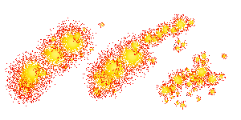

# React "Todo" Exercise

***This exercise focuses on React and will not cover any backend implementation.***

This exercise is ment to be used in combination with a live course on the subject and contains no theory of its own.

Each step of the exercise includes at least one new feature of React development and after the last step you will have gone from a clean slate to a small app.

## Tools required
*(Use the latest LTS versions)*
- Node.js
- npm
- Visual Studio Code.
- Chrome

## [1 - Hello World](1%20-%20Hello%20World)

* Creating a new project

## [2 - Hello Component](2%20-%20Hello%20Component)

* Creating a component
 
## [3 - Hello Props](3%20-%20Hello%20Props)

* Intoducing props
 
## [4 - A Todo](4%20-%20A%20Todo)

* Intoducing styling
 
## [5 - Many Todos](5%20-%20Many%20Todos)

* Intoducing lists

## [6 - Interactive Todos](6%20-%20Interactive%20Todos)

* Intoducing state

## [7 - Creating Todos](7%20-%20Creating%20Todos)

* Creating a controlled component

## [8 - Stored Todos](8%20-%20Stored%20Todos)

* Working with effects and asynchronous calls

## [9 - A Welcoming Page](9%20-%20A%20Welcoming%20Page)

* Working with React Router

## [10 - Adding Users](10%20-%20Adding%20Users)

* Working with a shared context

## [11 - Error Boundary](11%20-%20Error%20Boundary)

* Using Error Boundaries to catch markup-exceptions

## [12 - Writing A Test](12%20-%20Writing%20A%20Test)

* Writing tests using React Testing Library